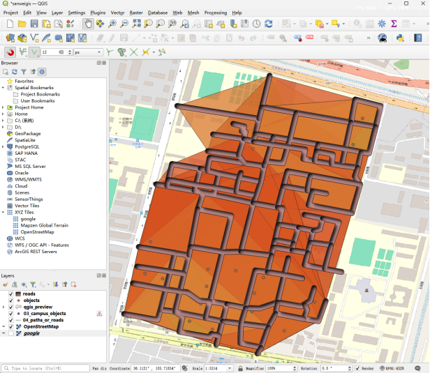
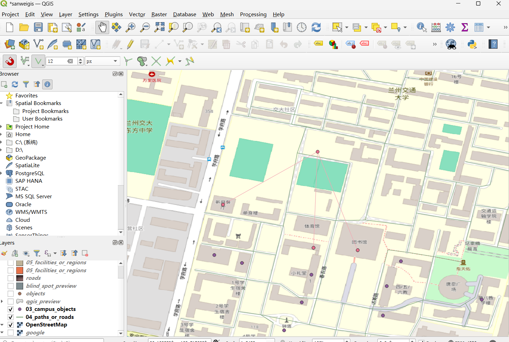
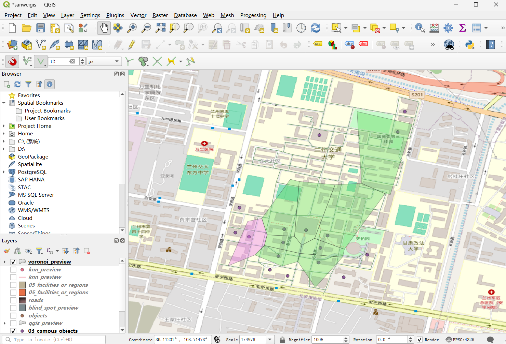

# 🏫 智慧校园 GIS 空间分析系统

<p align="center">
  <b>Smart Campus GIS Spatial Analysis Engine</b><br>
  基于 Python + 图论算法的校园设施可达性量化评估与空间优化平台
</p>

<p align="center">
  
  
  
  
</p>

---

## 目录

- [项目简介](#项目简介)
- [🎥 功能演示](#-功能演示)
- [核心功能](#核心功能)
- [三维可视化预览](#三维可视化预览)
- [技术架构](#技术架构)
- [项目结构](#项目结构)
- [快速开始](#快速开始)
- [API 接口文档](#api-接口文档)
- [算法详解](#算法详解)
- [数据格式规范](#数据格式规范)
- [常见问题](#常见问题)
- [贡献指南](#贡献指南)
- [开源协议](#开源协议)
- [致谢](#致谢)

---

## 项目简介

在大学校园规划中，**设施布局是否合理**直接影响师生的日常生活体验。本项目利用 **NetworkX 图论建模** 与 **GeoPandas 矢量空间分析**，对校园生活服务设施（食堂、教学楼、宿舍、超市等）进行全方位的可达性量化评估，为校园规划部门提供数据驱动的决策支持。

系统采用 **Flask 后端 + CesiumJS 三维前端** 架构，支持在三维数字地球上交互式地进行空间分析，所有算法结果实时渲染为 GeoJSON 图层。

---

## 🎥 功能演示

<p align="center">
  <b>👇 点击下方图片观看完整功能演示视频</b>
</p>

<!-- 将你的演示视频拖到 GitHub Issue 编辑框上传，复制生成的链接替换下方 src -->

<p align="center">
  <video src="https://github.com/你的用户名/Campus-GIS-Path-Optimization/assets/你的视频文件.mp4"
         controls="controls" width="90%" style="max-width: 900px; border-radius: 12px;">
  </video>
</p>

> 💡 **提示**：如果你还没有录制视频，可以用 [OBS Studio](https://obsproject.com/)（免费）录制 1-2 分钟的 CesiumJS 三维交互演示，展示地球旋转、路径动画、等时圈扩散等效果，然后拖到 GitHub Issue 编辑框中上传，把生成的链接替换上面即可。

---

## 核心功能

| 序号 | 功能模块 | 核心算法 | 空间复杂度 | 应用场景 |
|:---:|---------|---------|:---:|---------|
| 1 | **多级等时圈分析** | Dijkstra 扩散搜索 | O((V+E) log V) | 评估 5/10/15 分钟步行服务覆盖范围 |
| 2 | **最短路径规划** | Dijkstra 加权最短路径 | O((V+E) log V) | 高精度校园步行导航，支持任意起终点 |
| 3 | **服务覆盖盲区识别** | 空间差异运算 (Difference) | O(n log n) | 精准定位校园设施布局空白区 |
| 4 | **最近邻检索 (KNN)** | KD-Tree 空间索引 | O(log n) | 毫秒级查询离用户最近的设施 |
| 5 | **食堂服务分区** | Voronoi 泰森多边形 + 边界裁切 | O(n log n) | 划分校园设施的逻辑服务腹地 |

---

## 三维可视化预览

> 以下截图均来自 **CesiumJS 三维数字地球** 实时渲染，支持旋转、缩放、倾斜视角交互

<p align="center">
  
</p>

<p align="center">
  <em>▲ 从校园各食堂出发的 5/10/15 分钟步行等时圈，红色区域为未覆盖的服务盲区</em>
</p>

<br>

<p align="center">
  
</p>

<p align="center">
  <em>▲ 基于 Dijkstra 算法的校园最优步行路径规划，蓝色线条为推荐路径</em>
</p>

<br>

<table align="center">
  <tr>
    <td align="center" width="50%">
      <br>
      <em>▲ KNN 最近邻检索</em>
    </td>
    <td align="center" width="50%">
      <br>
      <em>▲ Voronoi 食堂服务分区</em>
    </td>
  </tr>
</table>

---

## 技术架构

```
┌─────────────────────────────────────────────────────┐
│                    前端展示层                         │
│   CesiumJS 1.105  │  原生 HTML5/CSS3  │  Fetch API  │
│   三维数字地球      │  暗色面板 UI       │  AJAX 通信   │
└──────────────────────┬──────────────────────────────┘
                       │ HTTP REST API (JSON)
┌──────────────────────┴──────────────────────────────┐
│                    后端服务层                         │
│   Flask 3.0+  │  Flask-CORS  │  RESTful API 设计    │
└──────────────────────┬──────────────────────────────┘
                       │
┌──────────────────────┴──────────────────────────────┐
│                    算法引擎层                         │
│  ┌──────────┐ ┌──────────┐ ┌──────────┐            │
│  │NetworkX  │ │ SciPy    │ │ Shapely  │            │
│  │图论建模   │ │KD-Tree   │ │几何运算   │            │
│  └──────────┘ └──────────┘ └──────────┘            │
│  ┌──────────────────────────────────────┐           │
│  │         GeoPandas 矢量处理            │           │
│  └──────────────────────────────────────┘           │
└──────────────────────┬──────────────────────────────┘
                       │
┌──────────────────────┴──────────────────────────────┐
│                    数据存储层                         │
│   GeoJSON  │  JSON  │  EPSG:4326 / EPSG:3857        │
└─────────────────────────────────────────────────────┘
```

### 技术栈详情

| 层级 | 技术 | 版本 | 用途 |
|:---|------|:---:|------|
| 后端框架 | Flask | 3.0+ | Web API 服务 |
| 跨域 | Flask-CORS | 4.0+ | 前后端分离跨域支持 |
| 图论 | NetworkX | 3.2+ | 路网图构建、最短路径、图搜索 |
| 矢量处理 | GeoPandas | 0.14+ | 空间数据读写、投影转换 |
| 几何运算 | Shapely | 2.0+ | 凸包、缓冲区、空间差异 |
| 空间索引 | SciPy | 1.11+ | KD-Tree 构建与查询 |
| 数值计算 | NumPy | 1.26+ | 矩阵运算、坐标处理 |
| 前端引擎 | CesiumJS | 1.105 | 三维数字地球渲染 |
| 坐标系 | EPSG:4326 / 3857 | — | WGS84 存储 / 墨卡托计算 |

---

## 项目结构

```
Campus-GIS-Path-Optimization/
│
├── app.py                              # Flask 主入口，API 路由定义
├── index.html                          # CesiumJS 前端单页应用
├── requirements.txt                    # Python 依赖清单
├── LICENSE                             # MIT 开源协议
├── README.md                           # 项目说明文档
├── .gitignore                          # Git 忽略规则
│
├── data/                               # 输入数据目录
│   ├── 03_campus_objects.json          # 校园设施点数据 (GeoJSON Point)
│   ├── 04_paths_or_roads.geojson       # 校园路网数据 (GeoJSON LineString)
│   ├── 05_facilities_or_regions.geojson # 校园边界/面数据 (GeoJSON Polygon)
│   ├── analysis_result_isochrone.json  # 等时圈分析结果
│   ├── analysis_result_dijkstra.json   # 最短路径分析结果
│   ├── analysis_result_knn.json        # KNN 分析结果
│   ├── analysis_result_voronoi.json    # Voronoi 分析结果
│   ├── analysis_result_blind_spots.json # 盲区分析结果
│   └── blind_spot_preview.geojson      # 盲区预览数据
│
├── results/                            # 输出结果目录
│   ├── isochrone_preview.geojson       # 等时圈预览
│   ├── dijkstra_preview.geojson        # 路径预览
│   ├── knn_preview.geojson             # KNN 预览
│   ├── voronoi_preview.geojson         # Voronoi 预览
│   └── blind_spot_preview.geojson      # 盲区预览
│
├── scripts/                            # 核心算法脚本
│   ├── data_config.py                  # 数据路径统一配置
│   ├── isochrone_analysis.py           # 等时圈分析算法
│   ├── dijkstra_path_analysis.py       # 最短路径分析算法
│   ├── knn_search_analysis.py          # KNN 最近邻检索算法
│   ├── blind_spot_analysis.py          # 服务盲区识别算法
│   └── voronoi_analysis.py             # Voronoi 服务分区算法
│
├── visuals/                            # 可视化截图
│   ├── 等时圈分析结果截图.png
│   ├── 基于 Dijkstra 算法的校园最优步行路径规划示例.png
│   ├── KNN.png
│   ├── blind_spot_analysis.png
│   └── 基于泰森多边形算法的校园食堂服务腹地划分图.png
│
└── (各算法独立运行子目录)
    ├── Dijkstra 最短路径分析/
    ├── KNN/
    ├── blind_spot_analysis/
    ├── 等时圈分析/
    └── 食堂服务分区/
```

---

## 快速开始

### 环境要求

- **Python** 3.10 或更高版本
- 操作系统：Windows / macOS / Linux

### 安装步骤

```bash
# 1. 克隆仓库
git clone https://github.com/2178722445/Campus-GIS-Path-Optimization.git
cd Campus-GIS-Path-Optimization

# 2. 创建虚拟环境（推荐）
python -m venv venv

# Windows 激活
venv\Scripts\activate

# macOS / Linux 激活
source venv/bin/activate

# 3. 安装依赖
pip install -r requirements.txt

# 4. 启动服务
python app.py
```

浏览器访问 **http://127.0.0.1:5000** 即可使用。

### 依赖清单

```
flask>=3.0.0
flask-cors>=4.0.0
geopandas>=0.14.0
networkx>=3.2
shapely>=2.0.0
scipy>=1.11.0
numpy>=1.26.0
```

---

## API 接口文档

### 基础服务

| 方法 | 端点 | 说明 |
|:---|------|------|
| `GET` | `/` | 返回 CesiumJS 前端页面 |
| `GET` | `/api/health` | 服务健康检查 |

### 数据管理

| 方法 | 端点 | 参数 | 说明 |
|:---|------|------|------|
| `GET` | `/api/data/status` | — | 查询数据状态、要素数量、地理边界 |
| `GET` | `/api/data/preview` | — | 获取全部 GeoJSON 数据 |
| `POST` | `/api/data/upload` | `facilities`, `roads`, `polygons` | 上传 GeoJSON 数据文件 |

### 空间分析

| 方法 | 端点 | 参数 | 说明 |
|:---|------|------|------|
| `GET` | `/api/analysis/isochrone` | `lon`, `lat` | 等时圈分析，返回 5/10/15 分钟覆盖圈 |
| `GET` | `/api/analysis/path` | `slon`, `slat`, `elon`, `elat` | 最短路径规划 |
| `GET` | `/api/analysis/knn` | `lon`, `lat` | 最近邻检索 |
| `GET` | `/api/analysis/blind_spot` | — | 盲区识别（需先运行等时圈） |
| `GET` | `/api/analysis/voronoi` | — | Voronoi 服务分区 |

### 响应格式

```json
{
  "ok": true,
  "data": [...],
  "error": ""
}
```

---

## 算法详解

### 1. 等时圈分析 (Isochrone)

```
输入: 路网 GeoJSON + 设施点坐标 + 时间阈值 [5min, 10min, 15min]
输出: 多级等时圈多边形 GeoJSON

流程:
  1. 读取路网，构建 NetworkX 无向加权图
     边权重 = 路段长度 / 步行速度 (1.2 m/s)
  2. 设施点坐标投影到路网最近节点
  3. Dijkstra 单源最短路径扩散
  4. 按时间阈值 (300s, 600s, 900s) 截取可达节点集
  5. 计算凸包 (Convex Hull) 生成等时圈面
  6. 投影回 WGS84 输出
```

### 2. 最短路径规划 (Dijkstra Pathfinding)

```
输入: 起点 (lon, lat) + 终点 (lon, lat)
输出: 最优路径 LineString GeoJSON

流程:
  1. 构建路网加权图
  2. 起终点投影到路网最近节点
  3. nx.shortest_path() 计算最优路径
  4. 节点序列映射回 WGS84 坐标
  5. 计算总路径长度（米）
```

### 3. 盲区识别 (Blind Spot)

```
输入: 等时圈结果 + 校园边界多边形
输出: 盲区多边形 GeoJSON

流程:
  1. 提取所有设施的 15 分钟等时圈（level=3）
  2. 融合为单一覆盖范围 (unary_union)
  3. 与校园边界做空间差异 (difference)
  4. 剩余区域即为服务盲区
```

### 4. 最近邻检索 (KNN)

```
输入: 查询点坐标 (lon, lat)
输出: 最近设施信息 + 距离

流程:
  1. 读取所有设施点坐标
  2. SciPy 构建 KD-Tree 空间索引
  3. O(log n) 查询最近邻
  4. 返回设施属性及距离
```

### 5. Voronoi 服务分区

```
输入: 设施点 + 校园边界多边形
输出: Voronoi 分区多边形 GeoJSON

流程:
  1. 设施点投影到 EPSG:3857
  2. SciPy Voronoi 生成泰森多边形
  3. 校园边界多边形裁切各分区
  4. 分区关联对应设施属性
  5. 投影回 WGS84 输出
```

---

## 数据格式规范

### 设施点数据

```json
{
  "type": "FeatureCollection",
  "features": [
    {
      "type": "Feature",
      "geometry": {
        "type": "Point",
        "coordinates": [104.1234, 30.5678]
      },
      "properties": {
        "name": "第一食堂",
        "type": "食堂",
        "id": "canteen_01"
      }
    }
  ]
}
```

### 路网数据

```json
{
  "type": "FeatureCollection",
  "features": [
    {
      "type": "Feature",
      "geometry": {
        "type": "LineString",
        "coordinates": [[104.123, 30.567], [104.124, 30.568]]
      },
      "properties": {
        "name": "银杏大道",
        "type": "主干道"
      }
    }
  ]
}
```

### 分析结果格式

```json
{
  "objectId": "canteen_01",
  "value": 300,
  "level": 1,
  "label": "第一食堂 5分钟服务圈",
  "style": {
    "color": "rgba(79, 140, 255, 0.3)",
    "outlineColor": "#4f8cff",
    "outlineWidth": 2
  },
  "description": "从第一食堂出发步行5分钟可达范围",
  "geometry": {
    "type": "Polygon",
    "coordinates": [[[104.123, 30.567]]]
  }
}
```

---

## 常见问题

<details>
<summary><b>Q: 启动后页面空白或 Cesium 不显示？</b></summary>

确保网络能访问 `cesium.com` 的 CDN。若网络受限，可下载 CesiumJS 离线包，修改 `index.html` 中的引用路径。
</details>

<details>
<summary><b>Q: 分析报错"未找到连通路径"？</b></summary>

可能路网数据不连通，或起终点距离路网太远。请检查路网是否覆盖整个校园，并在道路上点击选点。
</details>

<details>
<summary><b>Q: GeoPandas 安装失败？</b></summary>

GeoPandas 依赖 GDAL/Fiona 等 C 库。Windows 用户推荐使用 conda：

```bash
conda install geopandas
```
</details>

<details>
<summary><b>Q: 如何替换为自己的校园数据？</b></summary>

1. 准备三个 GeoJSON 文件：设施点、路网、校园边界
2. 通过 Web 界面上传，或替换 `data/` 目录下对应文件
3. 文件名需与 `scripts/data_config.py` 中的配置一致
</details>

---

## 贡献指南

1. **Fork** 本仓库
2. 创建特性分支：`git checkout -b feature/AmazingFeature`
3. 提交更改：`git commit -m 'feat: add some AmazingFeature'`
4. 推送到分支：`git push origin feature/AmazingFeature`
5. 开启 **Pull Request**

### Commit 规范

| 前缀 | 含义 |
|:---|------|
| `feat:` | 新功能 |
| `fix:` | 修复 bug |
| `docs:` | 文档更新 |
| `refactor:` | 代码重构 |
| `style:` | 代码格式调整 |

---

## 开源协议

本项目采用 [MIT License](LICENSE) 开源协议，可自由使用、修改和分发。

---

## 致谢

| 项目 | 用途 | 链接 |
|:---|------|------|
| CesiumJS | 三维数字地球引擎 | [cesium.com](https://cesium.com/) |
| NetworkX | 图论与网络分析 | [networkx.org](https://networkx.org/) |
| GeoPandas | 地理空间数据处理 | [geopandas.org](https://geopandas.org/) |
| SciPy | KD-Tree 空间索引 | [scipy.org](https://scipy.org/) |
| Shapely | 计算几何运算 | [shapely.readthedocs.io](https://shapely.readthedocs.io/) |
| Flask | Web 微框架 | [flask.palletsprojects.com](https://flask.palletsprojects.com/) |

---

<p align="center">
  <sub>Made with ❤️ for smarter campus planning</sub>
</p>