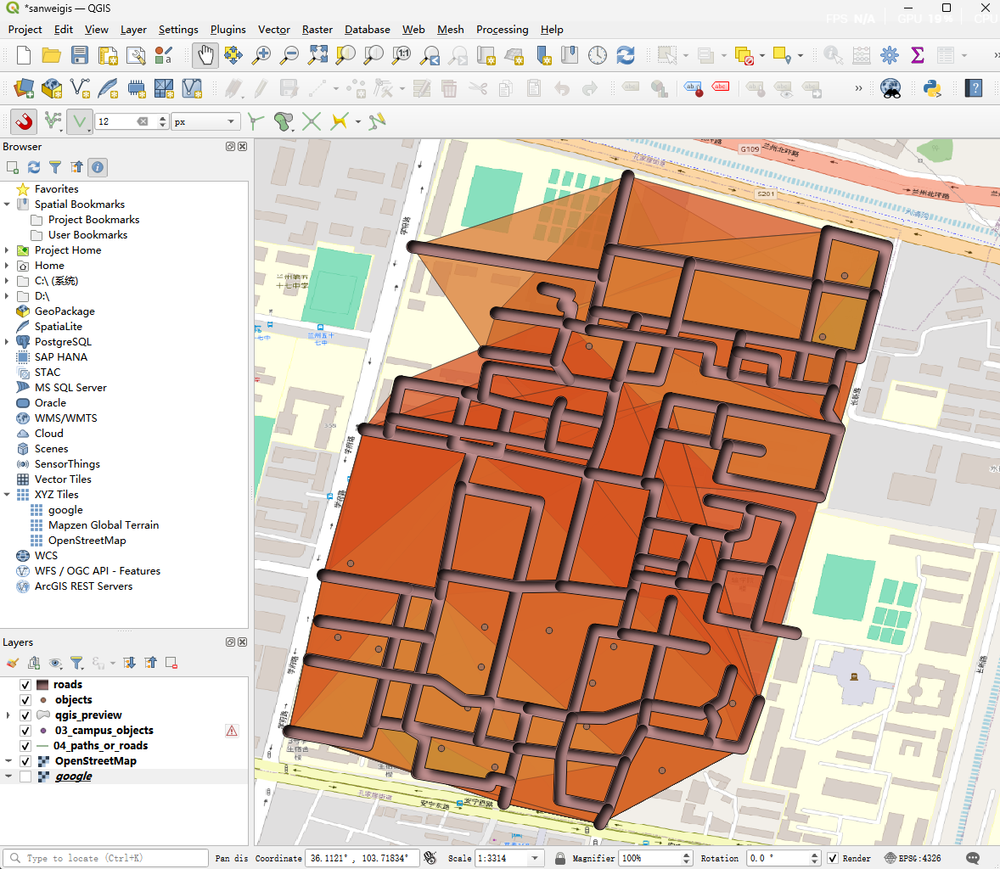

# Campus-GIS-Path-Optimization
# 校园生活服务设施可达性评价算法 (Python-based WebGIS Engine)

## 项目简介
本项目针对校园生活服务设施（食堂、打印点、停车点）开发了一套基于 **图论算法** 的可达性量化分析模块。
该模块作为三维 WebGIS 系统的前端决策引擎，通过 Python 实现多级等时圈（Isochrone）计算，为校园空间规划提供数据支撑。

## 技术栈
- **核心算法：** Dijkstra 最短路径算法 (NetworkX)
- **空间计算：** GeoPandas, Shapely (Convex Hull 拟合)
- **坐标系统：** WGS84 (EPSG:4326) 与 Web Mercator (EPSG:3857) 动态投影转换
- **可视化验证：** QGIS

## 算法逻辑描述
1. **网络拓扑构建：** 将校园路网 GeoJSON 转换为带权图 (Weighted Graph)，以通行时间作为 Edge Weight。
2. **最近邻挂接：** 通过空间分析将离散设施点自动捕捉至最近的路网节点。
3. **多级搜索：** 基于 `Dijkstra` 扩散搜索，获取 5/10/15 分钟内的所有可达节点集合。
4. **结果封装：** 利用凸包算法生成服务区面要素，并封装为符合 Cesium 渲染规范的 JSON 格式。

## 结果展示

*图：兰州交通大学 5/10/15 分钟步行可达性分析预览（绿/黄/红分级）*

## 规范说明
生成的 `analysis_result_isochrone.json` 包含以下字段：
- `objectId`: 关联设施唯一标识
- `level/value`: 响应的时间梯度
- `style`: 预定义渲染样式
- `geometry`: GeoJSON 标准几何体
