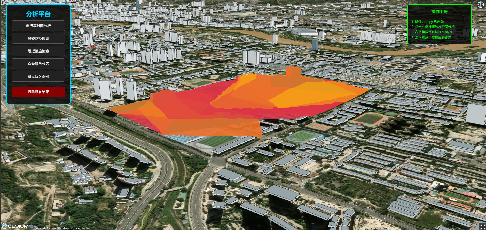
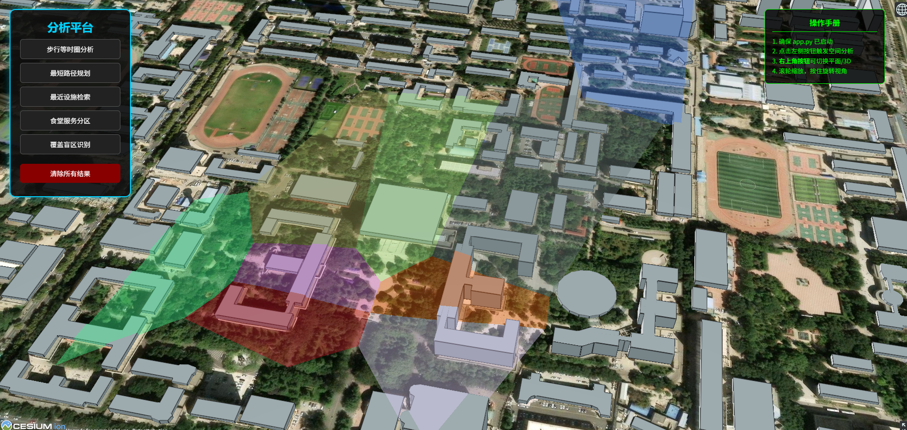

#  智慧校园空间分析微服务系统 (Smart Campus GIS Full-Stack)

##  项目亮点
本项目实现了一套从 **底层算法 -> 后端集成 -> 三维渲染** 的全栈 WebGIS 解决方案。系统不仅能进行复杂的空间计算，更通过 3D 引擎实现了分析结果的动态感知。

##  核心技术架构
- **算法引擎 (Python)**：基于 `NetworkX` 和 `SciPy` 独立实现 Dijkstra 路径、多级等时圈、泰森多边形分区、盲区识别及 KNN 检索。
- **服务端 (Flask)**：构建标准化的 RESTful API 接口，实现空间算法的微服务化，支持跨域(CORS)调用。
- **可视化端 (CesiumJS)**：集成全球 3D 建筑白模与高清卫星底图，采用 **Classification 贴地渲染技术** 解决 3D 空间遮挡问题。

##  成果展示

*图：前端基于 Cesium 的校园 3D 分析可视化效果*

##  快速启动
1. **环境准备**：`pip install -r requirements.txt`
2. **启动后端**：`python app.py`
3. **运行前端**：使用 VS Code 的 `Live Server` 插件打开 `index.html`。
4. **默认接口**：`http://127.0.0.1:5000/api/analysis/isochrone`

##  目录结构说明
- `/scripts`: 五大核心空间分析算法源码
- `/data`: 校园路网、设施点、边界等原始 GeoJSON 数据
- `app.py`: Flask 后端服务主程序
- `index.html`: CesiumJS 三维交互前端
